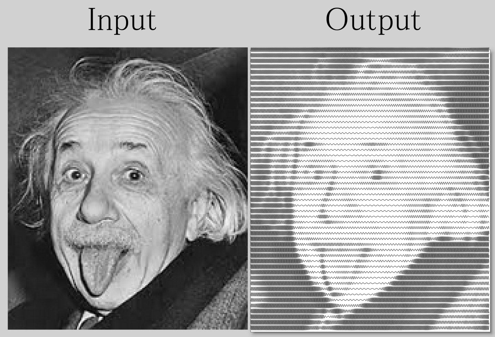

# SineHalftone
A python script that creates an SVG vector line dither or halftone effect from an input bitmap, modulated by frequency and amplitude. This may be a useful effect for people using a pen plotter or engraver.
This is by no means my original idea but I couldn't think of an easy way of doing it in Inkscape so I wrote this script. Searching "squiggle portrait" yields works with a similar style and I realised after writing this, that this is probably just a worse version of the [SquiggleDraw](https://github.com/gwygonik/SquiggleDraw) and [SquiggleCam](https://msurguy.github.io/SquiggleCam/) repos but oh well.
At some point I would like to turn this into an inkscape extension.

Below is an example of the effect it produces. The input test file width was about 175px.

Source: [Wikimedia Commons](https://en.wikipedia.org/wiki/File:Albert_Einstein_sticks_his_tongue.jpg)

# Installation
Just install the dependent modules from pip.

# Usage
You need to specify the input file path.
You can change various parameters to adjust the specific effect, such as the number of y-axis pixels per strip used to create the lines (ie. the number of sine waves), the frequency scaling and amplitude of the wave and so on. There is also a Gaussian smoothing function if you would like to horizontally blur the input image (increase `sigma`).
If you find that the SVG is spiky from low resolution, you can increase the `oversample` parameter. This value is the number of x-axis samples used to draw the sine wave per pixel. Reduce this to reduce the output filesize. A value of 50 should be massively overkill, 5 is probably too little. 
